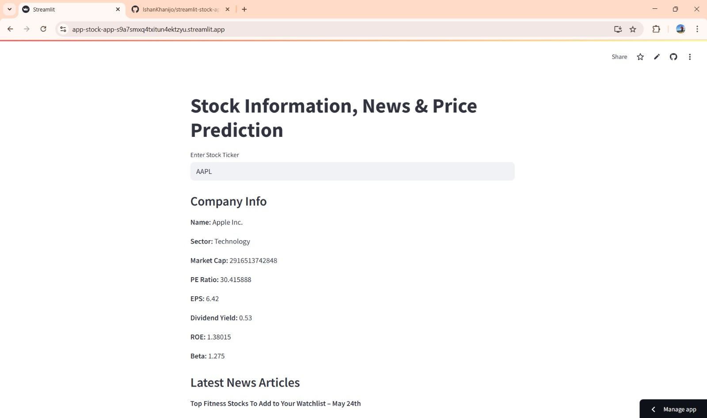
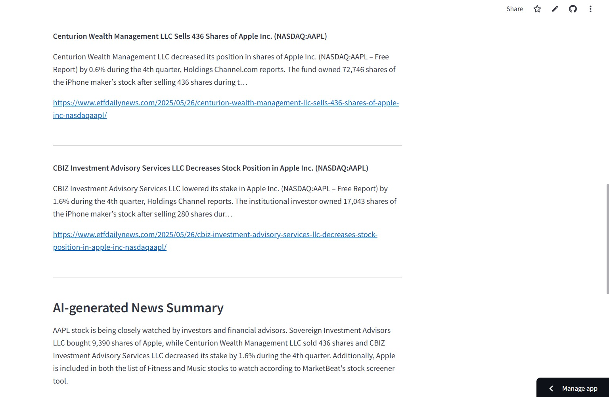

# 🧠 Stock Information, News & Price Prediction App
## Friendly neighborhood stock investment assistant

This Streamlit app allows users to:

- 📈 View company fundamentals using **yfinance**
- 📰 Get the latest stock-related **news articles**
- 🤖 Generate **AI-powered news summaries** via OpenAI
- 📊 Visualize historical stock prices
- 🔮 Predict next-day stock prices using an **LSTM model**

---

## 🔍 Example Outputs

### Company Info + News Feed


### AI-Generated Summary


### Historical Stock Price Chart


### LSTM Prediction Output


---

## 🚀 Try It Live

🔗 [Click here to launch the app](https://app-stock-app-s9a7smxq4txitun4ektzyu.streamlit.app/)

---

## 🛠️ Technologies Used

- Python
- Streamlit
- YFinance
- OpenAI GPT
- TensorFlow/Keras
- Scikit-learn
- Plotly
- NewsAPI

---

## 📦 Installation

```bash
pip install -r requirements.txt
streamlit run app.py
